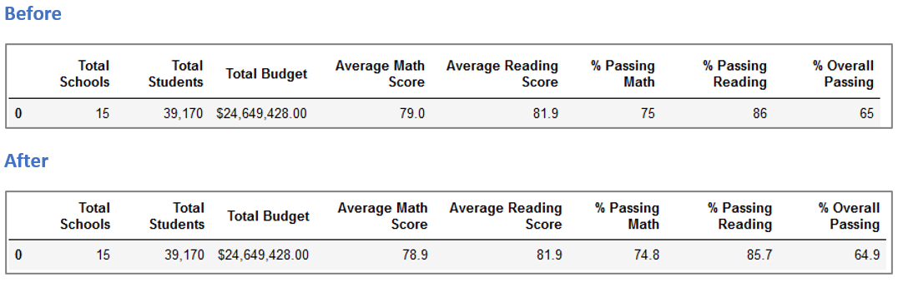

# School_District_Analysis
## Overview of the School District Analysis
After discovering evidence of dishonesty for one of the schools, specifically *math* and *reading* scores for *ninth graders* at *Thomas High School*, we need to reanalyze the school district data excluding the mentioned scores. Once the analysis is complete, then we need to compare results with the previous analysis and describe the effect of these changes.

## Results
### How is the district summary affected?

The average math score, passing math %, passing reading %, and the overall passing % have dropped as per the image below:

### How is the school summary affected?

The school summary was not effected except for Thomas High School where the overall passing score has dropped by 0.32 points.

### How is Thomas High School affected?

All scores and percentages dropped for Thomas High School except the average reading score. The table below will illustrate:

### How does replacing the ninth-grade scores affect the following:
- **Math and reading scores by grade:** Average math and reading scores for the 9th grade have dropped as per the chart below:

- **Scores by school spending:** Scores by school spending were not effected:

- **Scores by school size:** Scores by school size were not effected:

- **Scores by school type:** Scores by school type were not effected:

## Summary

Four major changes in the updated school district analysis after reading and math scores for the ninth grade at Thomas High School have been replaced with NaNs:

1.	Average math scores went down by 0.1 points
2.	Total percentage of students passing math went down 0.2%
3.	Total percentage of students passing reading went down 0.3%
4.	Total percentage of students passing math and reading went down 0.1%

---

